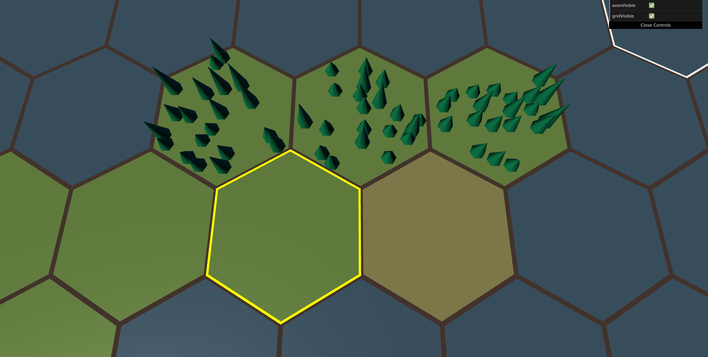

# three-hex-map

A civ like 3D hexagonal terrain map based on three.js. See the [demo](https://gunyakov.github.io/three-hex-map/public/index.html).



Project was inspired by [threejs-hex-map](https://github.com/Bunkerbewohner/threejs-hex-map).

## Overview

* project just started for learning threejs, result is on screen.

### Installation

```
git clone https://github.com/gunyakov/three-hex-map.git

cd three-hex-map

npm install

npm run start

npm run server
```

Open [http://127.0.0.1:3000](http://127.0.0.1:3000) in your browser.

### Links

Path finder by [weixiaofan](https://github.com/weixiaofan/hexpath)[^1]

[^1]: I reedit source code to be compatible with the typescript and orginize the class for simple use in the future. Modification to take care about unit restrictions and land type. 