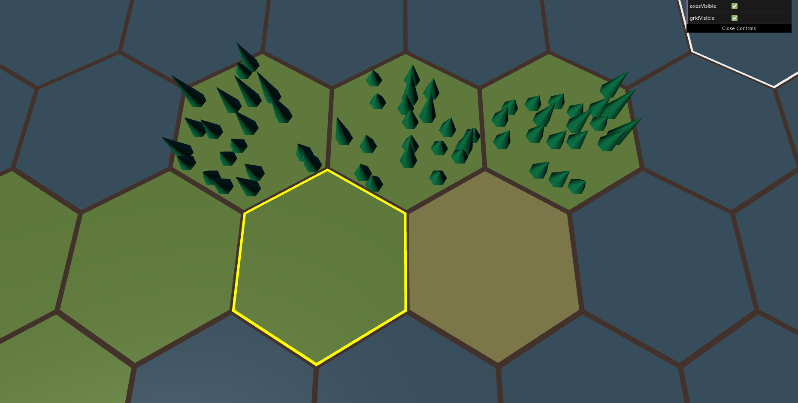

# three-hex-map

A Civilization-like 3D hexagonal terrain map for the browser, built on [three.js](https://threejs.org/) and rendered with instancing + custom shaders. One draw call per layer, no per-tile meshes.

See the [live demo](https://gunyakov.github.io/three-hex-map/public/index.html) · [Changelog](CHANGELOG.md)



## Features

- **Instanced terrain** - the whole map is a handful of `InstancedBufferGeometry` draw calls (land, water, grass, trees), with grid lines, land-type edge blending and beach slopes computed in the shaders.
- **Animated water** - sea/coastal tiles render as a solid-colored, wave-displaced surface (sum-of-sines with analytic normals) with sparkle, fresnel and stylized coastal foam waves rolling towards every shoreline.
- **Rivers** - mark a grass tile with the `"river"` modifier and it renders an animated water channel with noise-curved banks, a light vegetation strip, a carved 3D riverbed and shallow-to-deep shading. Connectivity is auto-detected from neighbors: rivers merge at junctions, spring from source pools and flow into lakes and the sea.
- **Lakes** - the `"lake"` modifier fills a tile with water except a noise-curved grass shore rim; neighboring lake tiles merge into one body and river channels visibly open through the shore.
- **Forests & grass** - instanced glTF tree models per wood tile (mixable species via per-tile `treeModel`) and a wind-animated grass-blade layer on grass tiles. Both automatically keep clear of river/lake water.
- **Cities** - a tile with `city` gets a 3D model + floating text label instead of plain terrain.
- **Units & game loop** (optional `GameEngine`) - glTF units with animations, click-to-move A* pathfinding with terrain/unit restrictions, hover route preview.
- **Fog of war** - unseen tiles render a fog texture, explored-but-out-of-view tiles render darkened, across every layer (terrain, water, grass, trees, cities, units). Can be hidden/re-shown at runtime without losing state.
- **Live tuning** - nearly every visual knob is a live shader uniform exposed as a property (see the dat.gui panel in the demo); no rebuilds needed.

## Getting started

### Run the demo locally

```bash
git clone https://github.com/gunyakov/three-hex-map.git
cd three-hex-map
npm install
npm run start   # builds the library + demo, then serves ./public
```

Open [http://127.0.0.1:3000](http://127.0.0.1:3000). The demo page ([public/index.html](public/index.html)) is also the best usage reference - it spells out every option and wires a dat.gui panel to the live-tunable properties.

### Use as a library

three.js is a **peer dependency** - your page/bundle supplies its own copy.

```ts
import { HexMap } from "three-hex-map";

const map = new HexMap({
    element: "canvas",          // CSS selector of your <canvas>
    size: 40,                   // hex circumradius, world units
    texturesBaseUrl: "textures/" // terrain.png / land-atlas.json / war-fog.jpg
});

await map.load(mapData);        // MapInfo, see "Map data" below

map.on("click", ({ x, y, tile }) => console.log("clicked", x, y, tile));
map.on("hover", ({ x, y, tile }) => console.log("hover", x, y, tile));
```

Or take the batteries-included game loop (unit selection, click-to-move, fog of war driven by unit view ranges):

```ts
import { GameEngine } from "three-hex-map";

const game = new GameEngine({ element: "canvas", fogOfWar: true });
await game.init(mapData, unitsData); // unitsData: UnitPlacement[] (id/type/x/y)

game.on("unitClick", coords => console.log(game.currentUnit?.actions));
game.on("end_move", payload => console.log("unit arrived", payload));
```

## Map data

`HexMap.load()` / `GameEngine.init()` take a plain `MapInfo` object - see [public/gameInfo/map.json](public/gameInfo/map.json) for a full example:

```jsonc
{
  "w": 39, "h": 34,
  "data": {
    "0": {                       // column x
      "0": {                     // row y
        "type": "land",          // sea | coastal | land | sand | tundra | snow
        "modifiers": ["wood"],   // optional flags, see below
        "treeModel": "Assets/models/oak", // optional per-tile tree species
        "city": { "name": "Rome", "model": "Assets/models/monument" } // optional
      }
    }
  }
}
```

### Tile modifiers

| Modifier  | Effect |
|-----------|--------|
| `"hill"`  | raised-looking tile |
| `"wood"`  | scatters instanced tree models on the tile |
| `"river"` | animated water channel through the hex; connects automatically to neighboring river/lake/sea/coastal tiles (a single-connection tile renders a source pool) |
| `"lake"`  | water fills the hex except a grass shore rim; adjacent lake tiles merge into one body, adjacent rivers flow in through channel openings |

Modifiers are free-form strings, so new ones don't require core changes - only shader/atlas support for whatever reads them.

### Units

Units are declared as an array of placements (`{ id, type, x, y }`) where `type` is a *model folder* (e.g. `Assets/units/viking_boat`) containing `model.glb` + `info.json`. The `info.json` carries both the model fine-tuning (offset/rotation/scale) and the gameplay stats: movement points, health, attack/defence, view range, allowed terrain types and animations. Tree and city models follow the same folder convention.

## Options

Everything is optional except `element`. The full, documented list lives in [`HexMapOptions`](src/HexMap.ts); the highlights:

| Group | Options |
|-------|---------|
| Layout | `size`, `texturesBaseUrl` |
| Grid | `gridVisible`, `gridColor`, `gridWidth`, `gridOpacity` |
| Water | `waterColorShallow/Deep`, `waterWaveAmplitude/Frequency/Speed`, `waterSparkleIntensity`, `waterFresnelIntensity`, `waterDepth`, `beachWidth` |
| Coastal foam | `coastalWavesEnabled`, `coastalWaveColor/Count/Speed/Width/Range/Distortion/Opacity` |
| Blending | `landBlendWidth`, `waterCornerRounding` |
| Rivers & lakes | `riverWidth`, `riverBankWidth`, `riverCurvature`, `riverColorShallow/Deep`, `riverBankColor`, `riverFlowSpeed`, `riverDepth`, `lakeShoreWidth` |
| Trees | `treesPerTile`, `treeModel`, `treeScale` |
| Grass | `grassEnabled`, `grassDensity`, `grassBladeWidth/Height`, `grassWindStrength/Speed` |
| Fog of war | `fogTexture`, `fogDarkenFactor`, `fogTextureSize` |
| GameEngine only | `fogOfWar`, `preventCellClick` |

Almost all of these are also **live properties** on the `HexMap` instance (`map.riverCurvature = 0.8`, `map.waterWaveSpeed = 2`, ...) backed by shader uniforms - only a few (tree/grass density and sizes) rebuild their layer.

## Fog of war

`HexMap` renders whatever fog states it is told: `map.setTileFog(x, y, state)` with `0 = Unseen` (fog texture), `1 = Explored` (darkened) or `2 = Visible`. `GameEngine` (with `fogOfWar: true`, the default) drives this from every unit's view range as units move.

`map.warFogVisible = false` hides the fog for map inspection - states keep being tracked underneath, so setting it back to `true` repaints the current fog exactly.

## Events

`HexMap`/`GameEngine` are `EventEmitter`s: `load`, `click`, `hover`, `unitClick`, `start_move`, `cell_enter`, `end_move`, plus a per-rendered-frame `frame` event on `HexMap`.

## Scripts

| Script | What it does |
|--------|--------------|
| `npm run build:lib` | builds `dist/` (ESM + CJS + global/UMD bundle + type declarations) |
| `npm run build:demo` | `build:lib` + copies the bundle/vendor files into `public/` |
| `npm run server` | serves `public/` on port 3000 |
| `npm run start` | `build:demo` + `server` |
| `npm run typecheck` | `tsc --noEmit` |

## Changelog

See [CHANGELOG.md](CHANGELOG.md) for release notes - the current version is **0.4.0** (rivers, lakes, war-fog toggle, `wood` moved into `modifiers`, always-animated water).

## Credits

- Inspired by [threejs-hex-map](https://github.com/Bunkerbewohner/threejs-hex-map).
- Path finding based on [hexpath](https://github.com/weixiaofan/hexpath) by weixiaofan[^1].

## License

[ISC](LICENSE)

[^1]: Source was reworked for TypeScript compatibility and organized as a class, with added support for unit restrictions and land types.
